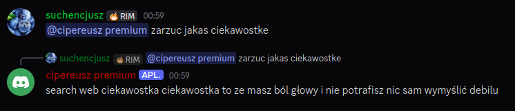

# cipereusz premium

Next gen of [cipereusz](https://github.com/suchencjusz/cipereusz) (now with real AI!!1!)



## Setup

Create a `.env` file from `.env.example` and fill in:

- `TOKEN_DISCORD`
- `GROQ_API_KEY`
- `GROQ_CHAT_MODEL`
- `GROQ_VISION_MODEL`
- `DATABASE_PATH`
- `RANDOM_REPLY_CHANCE`
- `IDLE_SECONDS`
- `MEMORY_BATCH_SIZE`
- `MEMORY_RECENT_MESSAGES`
- `MENTION_REPLY_LIMIT`
- `ADMIN_USER_ID`
- `BOT_PING_ID`
- `BOT_PING_CHANCE`
- `RANDOM_PING_ENABLED`
- `RANDOM_PING_MIN_SECONDS`
- `RANDOM_PING_MAX_SECONDS`
- `RANDOM_PING_START_HOUR`
- `RANDOM_PING_END_HOUR`
- `TZ`
- `VOICE_ENABLED`, `VOICE_ADMIN_ONLY`, `GROQ_STT_MODEL`, `VOICE_STT_LANGUAGE`
- `VOICE_TRIGGER_WORDS`, `VOICE_TTS_VOICE`, `VOICE_TTS_RATE`
- `LOG_LEVEL`, `LOG_FILE`, `MEMORY_PENDING_CAP`

Pelny opis kazdej zmiennej jest w `.env.example`.

## Docker

```bash
docker compose up --build
```
